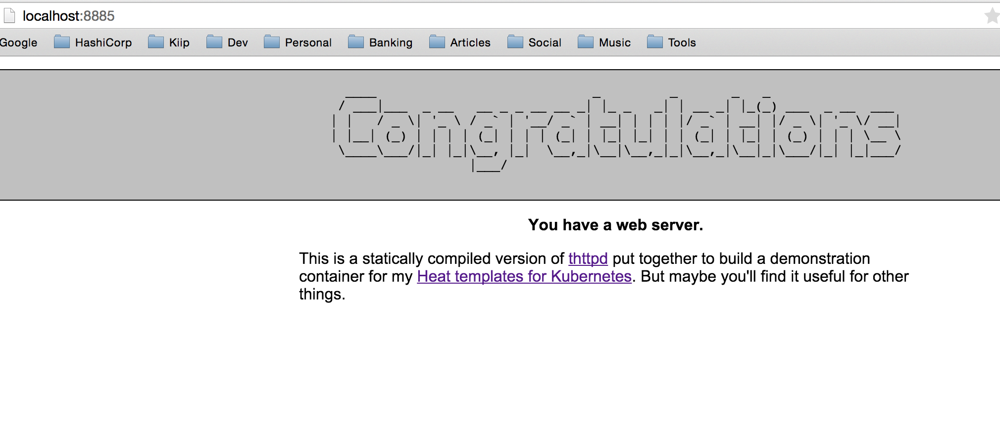
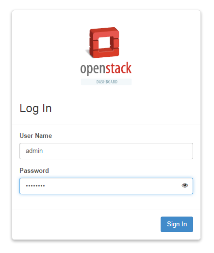
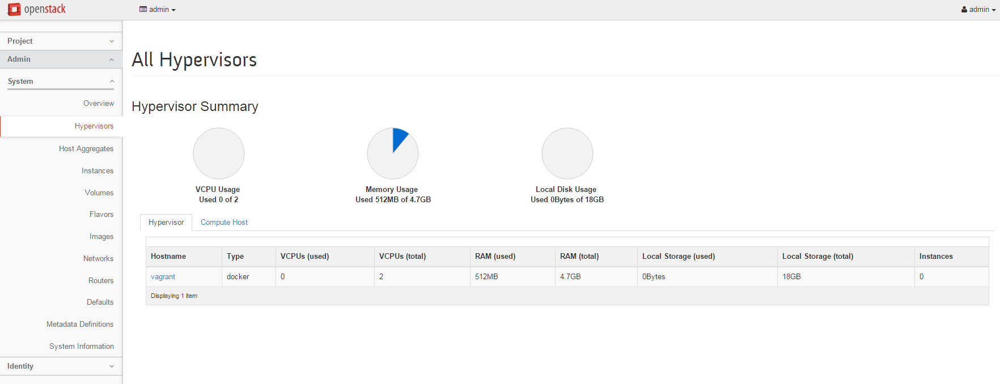
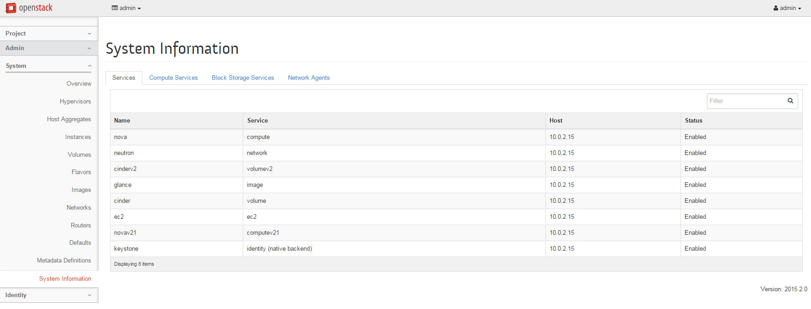
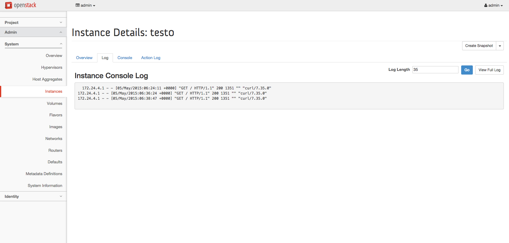

# devstack_docker
## For demo in Openstack HP Meetup

## Vagrantfile

```ruby
Vagrant.configure("2") do |config|
  config.vm.box = "alvaro/devstack_docker"
  config.vm.network "forwarded_port", guest: 80, host: 8888
  config.vm.network "forwarded_port", guest: 5000, host: 5555
  config.vm.provision :shell, privileged: false, :inline => "bash /vagrant/scripts/provision.sh"

  config.vm.provider :virtualbox do |vb|
    vb.customize ["modifyvm", :id, "--cpus", "2"]
    vb.customize ["modifyvm", :id, "--memory", "5000"]
  end
end

```

## Initial deployment on vagrant

```
real    23m34.177s                                                                                                                                                                                                         
user    0m31.950s                                                                                                                                                                                                          
sys     0m5.193s  
```

## Then

### Neutron configuration

```
vagrant ssh
cd /opt/stack/devstack
. openrc demo

neutron security-group-rule-create --protocol icmp \
--direction ingress --remote-ip-prefix 0.0.0.0/0 default

neutron security-group-rule-create --protocol tcp \
--port-range-min 22 --port-range-max 22 \
--direction ingress --remote-ip-prefix 0.0.0.0/0 default

neutron security-group-rule-create --protocol tcp \
--port-range-min 80 --port-range-max 80 \
--direction ingress --remote-ip-prefix 0.0.0.0/0 default

# To provide internet access to the containers
sudo iptables -t nat -A POSTROUTING -o eth0 -j MASQUERADE

```

### Starting a Docker container

```
. openrc admin

docker pull larsks/thttpd
docker save larsks/thttpd |
glance image-create --name larsks/thttpd \
  --is-public true --container-format docker \
  --disk-format raw

. openrc demo
nova boot --image larsks/thttpd --flavor m1.small test0

nova list
+----...+-------+--------+...+-------------+--------------------+
| ID ...| Name  | Status |...| Power State | Networks           |
+----...+-------+--------+...+-------------+--------------------+
| 0c3...| test0 | ACTIVE |...| Running     | private=internal_ip|
+----...+-------+--------+...+-------------+--------------------+

### Test Webpage on command line

$ curl http://internal_ip

<!DOCTYPE html>
<html>
        <head>
                <title>Your web server is working</title>
[...]

### Test Webpage on the computer

http://localhost:80nn where nn is the IP of the server

10.0.0.1 -> localhost 8881
10.0.0.2 -> localhost 8882
10.0.0.3 -> localhost 8883
10.0.0.4 -> localhost 8884
10.0.0.5 -> localhost 8885





### Create a floating ip address:

nova floating-ip-create
+------------+-----------+----------+--------+
| Ip         | Server Id | Fixed Ip | Pool   |
+------------+-----------+----------+--------+
| 172.24.4.3 | -         | -        | public |
+------------+-----------+----------+--------+
And assign it to our container:

$ nova floating-ip-associate test0 172.24.4.3
And now access our service:

$ curl http://172.24.4.3
<!DOCTYPE html>
<html>
        <head>            
                <title>Your web server is working</title>
[...]
```

### Openstack url

http://localhost:8888

http://ip_computer_demo:8888

admin / password

demo / password









